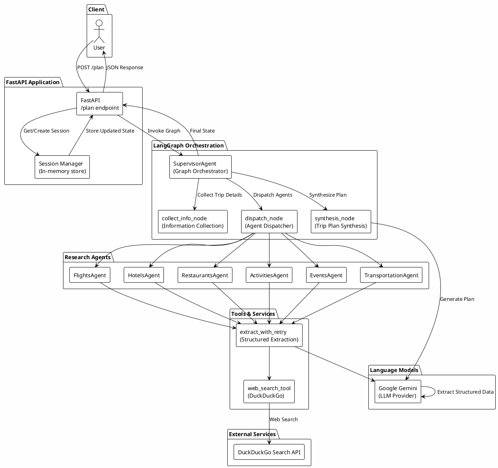
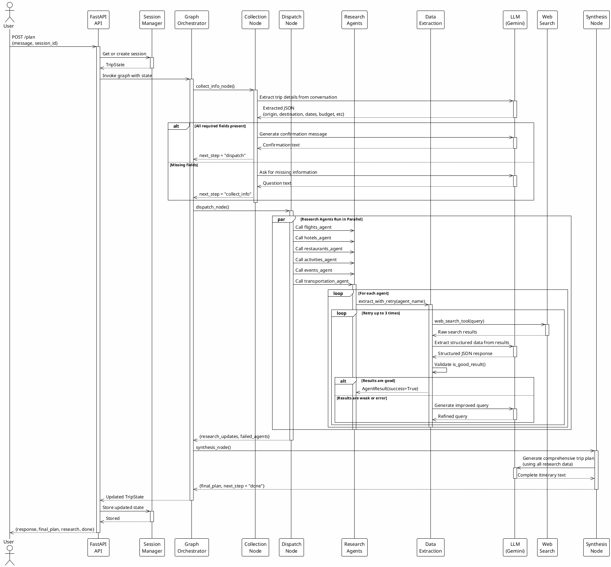

# AI Travel Planner Agent - Architecture

## System Overview

This document describes the architecture and workflow of the AI Travel Planner Agent system using PlantUML diagrams.

## High-Level Architecture Diagram



## Sequence Diagram - Trip Planning Flow



## Component Responsibilities

### Core Components

| Component | Responsibility |
|-----------|-----------------|
| **FastAPI Application** | HTTP endpoint handling, session management, request/response serialization |
| **SupervisorAgent** | Graph orchestration, state management, node routing |
| **collect_info_node** | Extract and validate trip requirements from conversation |
| **dispatch_node** | Launch and manage research agent execution |
| **synthesis_node** | Generate final trip itinerary from research data |

### Research Agents

Each agent follows the same pattern:
1. Create search query from trip request
2. Call `extract_with_retry()` with agent-specific extraction rules
3. Return structured data

| Agent | Searches For |
|-------|-------------|
| **FlightsAgent** | Flight options, airlines, prices, schedules |
| **HotelsAgent** | Accommodation options, ratings, amenities, prices |
| **RestaurantsAgent** | Restaurant recommendations, cuisine, prices, reservations |
| **ActivitiesAgent** | Tourist attractions, tours, activities, pricing |
| **EventsAgent** | Entertainment, concerts, shows, festivals |
| **TransportationAgent** | Local transit, taxis, rideshare, public transportation |

### Tools & Services

| Tool | Purpose |
|------|---------|
| **web_search_tool** | DuckDuckGo web search for information gathering |
| **extract_with_retry** | LLM-based structured data extraction with automatic query refinement |
| **Google Gemini LLM** | Information collection, data extraction, and trip plan synthesis |

## Data Flow

### State Model (TripState)

```
TripState {
    messages: List[Message]                    # Conversation history
    trip_request: Optional[TripRequest]        # Validated user requirements
    research: ResearchResults                  # Aggregated research data
    missing_fields: List[str]                  # Fields still needed
    next_step: str                             # Graph routing: "collect_info", "dispatch", "done"
    final_plan: Optional[str]                  # Synthesized trip itinerary
    budget_breakdown: dict                     # Cost allocation
    failed_agents: List[str]                   # Agents that couldn't find data
}
```

### TripRequest (Validated)

```
TripRequest {
    origin: str
    destination: str
    num_people: int
    start_date: str
    end_date: str
    budget_per_person: float
    interests: Optional[str]
}
```

### ResearchResults (Aggregated)

```
ResearchResults {
    flights: List[FlightOption]
    hotels: List[HotelOption]
    restaurants: List[RestaurantOption]
    activities: List[ActivityOption]
    events: List[EventOption]
    transportation_options: List[TransportationOption]
}
```

## Error Handling & Resilience

- **Extraction Retries**: Each agent tries up to 3 times with query refinement
- **Failed Agent Tracking**: Failed agents are logged and excluded from synthesis
- **Graceful Degradation**: Synthesis notes missing data rather than failing
- **Session Persistence**: State maintained across multiple user messages

## Logging & Visibility

The system provides comprehensive logging at INFO and DEBUG levels:
- **INFO**: Major node transitions, agent launches, result counts
- **DEBUG**: LLM invocations, query refinements, search results
- **ERROR**: Failures with full exception traces

## Scalability Considerations

1. **Parallel Agent Execution**: Research agents run concurrently via LangGraph
2. **Session-based State**: Each user session is independent and isolated
3. **Lazy LLM Loading**: LLMs instantiated only when needed
4. **Configurable Retries**: Extraction retry count and backoff strategies

